# Architecture

```mermaid
flowchart LR
    CLI[CLI and cancellation] --> D[Concurrent discovery]
    D --> P[Project boundaries and stable IDs]
    P --> W[Bounded project workers]
    W --> M[Static manifest extraction]
    M --> C[Optional scoped cleanup]
    C --> B[Bounded source bundling]
    B --> S[Private staging generation]
    S --> G[Publish immutable packs]
    G --> I[Atomically replace inventory]
    I --> A[Per-project AI analysis]
    A --> X[Catalog graph and architecture map]
```

- `cmd/polyaudit`: signal handling and process exit.
- `internal/cli`: interspersed flags, stdout formats, exit status.
- `internal/model`: versioned JSON contract and diagnostics.
- `internal/policy`: shared signatures, exclusions, source selection, cleanup protection.
- `internal/fsutil`: anchored, bounded reads and symlink checks.
- `internal/discover`: coordinator-owned work queue, fixed workers, sorted results.
- `internal/manifest`: JSON/YAML/Go parsers and conservative Elixir literal extraction.
- `internal/clean`: explicit deletion under individually anchored project roots.
- `internal/bundle`: deterministic source framing, size limits, optional gzip, hashes.
- `internal/catalog`: orchestration, nesting, output lock, immutable generations, publication.

The discovery coordinator owns its pending queue. Workers return child directory
paths; they never block trying to push children into their own work queue. This
avoids a common bounded-pool deadlock on wide directory trees. Results are sorted
before project processing. Workers write distinct slice indices and unique pack
paths; shared project-boundary maps are read-only.

Cleanup runs after complete discovery so it knows all nested project boundaries.
Parent and child projects can then run concurrently without processing each
other's source trees. Artifact directories are pruned before discovery rather than
searched for projects. Root handles constrain reads to the catalog and deletions
to the owning project. Explicit exclusion descendants protect cleanup ancestors.

The inventory's replacement is the publication commit point. Packs named in the
old inventory are never overwritten. A fatal error before commit leaves that
inventory usable. Independent source/manifest errors instead publish a clearly
diagnosed partial run; callers must inspect exit code 3 and the diagnostics.
`Sync` is used on pack and inventory files before publication; directory entries
are not fsynced, so power-loss durability is not promised.

The engine deliberately retains original source bytes and records omissions.
Token budgeting belongs to the downstream orchestrator: byte budgets cannot
predict a particular model's token count. Gzip is a transport/storage option and
must be decompressed before analysis. Neither pack framing nor these prompts is
a formal security boundary against malicious repository text.

Tests exercise nested ownership, repeated runs, deterministic gzip and plain
packs, cleanup containment, exclusions within deletion candidates, symlink
avoidance, partial failures, parser failures, output locks, size limits, JSON CLI
output, and cancellation. A small Elixir fuzz target checks malformed input.
